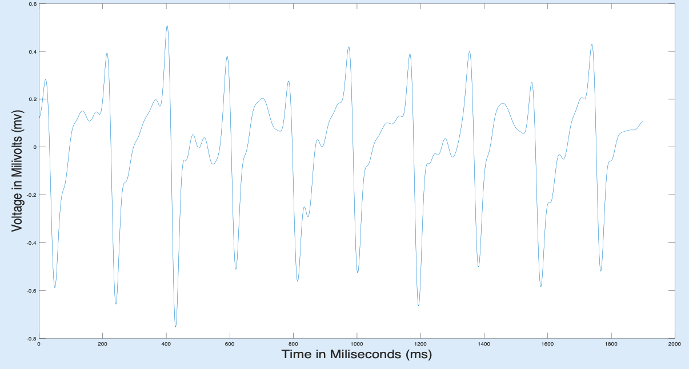
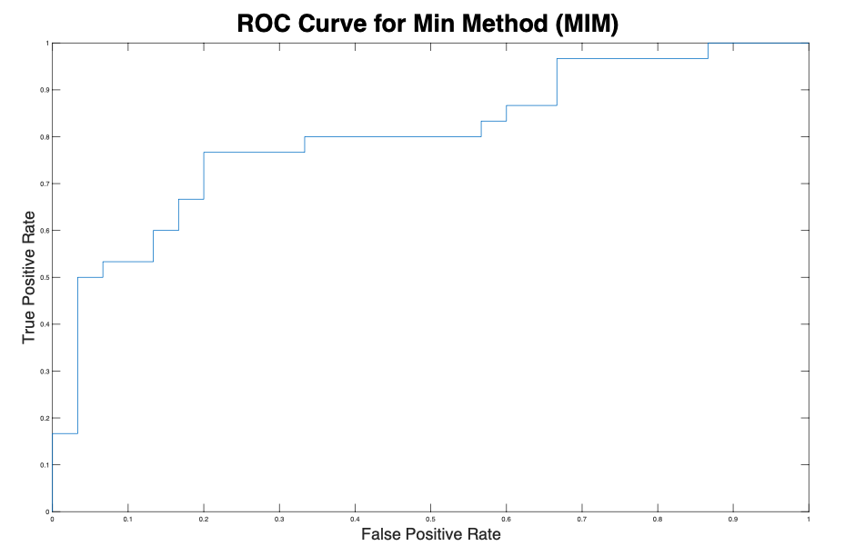
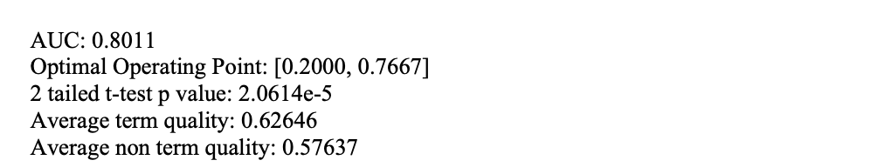

# UCSD-Research
This repository contains the code that I wrote for the electrogram signal quality project that I completed with [Rappel Laboratory at UCSD](https://rappel.ucsd.edu/) and [the Computational Arrhythmia Research Laboratory Stanford](http://web.stanford.edu/group/narayanlab/cgi-bin/wordpress/#:~:text=Welcome%20to%20the%20Computational%20Arrhythmia,clarify%20mechanisms%20and%20improve%20therapy.). The goal of the project was to improve ablation techniques in cardiac arrhythmia patients by developing an algorithm in MATLAB to quantify the quality of egms of patients. The software program contained here was coded entirely by me in MATLAB. This project has been completed, with a paper submitted to [Frontiers in Physiology](https://www.frontiersin.org/journals/physiology) which has not been published yet but is currently under review.

Three different calculus based methods are used to compute the quality of electrograms, MAM, MIM and AMM. MAM looks at the positive derivative of the electrogram, MIM looks at the negative derivative of the electrogram and AMM simply takes on whichever quality value is larger- MIM or MAM. The method uses the concept that a high quality electrogram will have either a large periodic positive slope or a large periodic negative slope and relatively small slopes elsewhere. The software program creates heat maps to visualize egm quality in specific locations of the heart. Additionally, ROC curves and histograms are computed to visualize how well the program can differentiate between low quality and high quality electrograms. After rigorous testing of the program, successful results were found in an analysis of 60 patient electrograms (See QualityResults_n60.pdf for a summary of these results).

### Example of High Quality vs Low Quality Electrograms

**The EGM shown above is a great example of an electrogram that would be marked as high quality by my method. The algorithm will mark this as high quality since there are large periodic negative slopes.**

**Figure 2 will be marked as low quality since there are not large periodic negative or positive slopes.**

### Example of High Quality vs Low Quality Color Maps

**Example of a high quality color map. Red areas indicate regions which should be targetted for ablation. Average quality is close to 1.**

**Example of a low quality color map. Average quality is around 0.5 indicating poor electrogram quality.**

### Good Results Found After Testing the Method on 60 Patients

